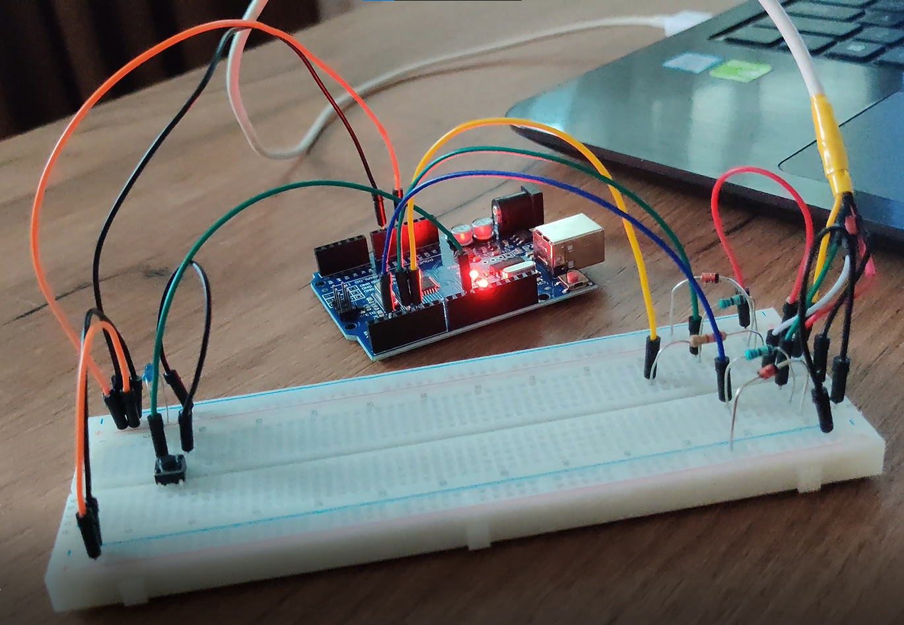

# Music-Lyrics-Player
Human Interface Device

Proiectul reprezinta implementarea unui HID periferic. Acesta consta dintr-un buton care, prin apasare, trimite pe ecran versurile unei melodii. Sistemul functioneaza prin intermediul unui cablu USB conectat la o placuta Arduino UNO.

Mai jos se regaste schema circuitului:

Link catre un scurt video cu modul de functionare al proiectului: https://www.youtube.com/watch?v=YWy7TSsyAp4
